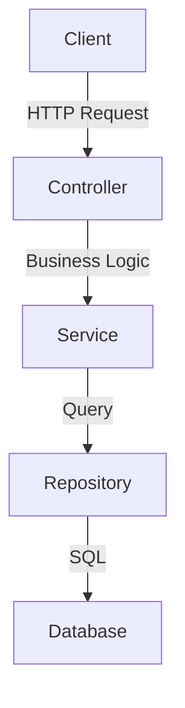

# Update Documentation Command

This command helps keep documentation synchronized with code changes. Documentation must be maintained as code evolves to prevent information decay.

## Usage

```bash
/update-docs                              # Review and update all changed docs
/update-docs MagicService                 # Update docs for specific component
/update-docs api-endpoints                # Update API documentation
/update-docs setup-guide                  # Update setup/installation docs
/update-docs architecture                 # Update architecture documentation
/update-docs --audit                      # Audit all documentation
```

## What This Command Does

1. **Spawns Documentation Agent**: Launches documentation specialist
2. **Scans Code Changes**: Finds what changed in recent commits
3. **Identifies Outdated Docs**: Detects documentation that's out of sync
4. **Suggests Updates**: Provides specific documentation updates needed
5. **Generates Examples**: Creates code examples from actual code
6. **Validates Links**: Checks for broken references and links
7. **Updates API Docs**: Regenerates API documentation from code
8. **Maintains Table of Contents**: Keeps navigation current

## Documentation Types

### 1. API Documentation

**Location**: `docs/api/`

**What to Document**:
- Endpoint URL and method
- Request parameters and types
- Response format and types
- Error codes and messages
- Authentication requirements
- Rate limiting
- Examples

**Template**:
```markdown
## Get Magic by ID

**Endpoint**: `GET /api/magic/{publicMagicId}`

**Authentication**: Required (Bearer token)

**Parameters**:
| Name | Type | Required | Description |
|------|------|----------|-------------|
| publicMagicId | string | Yes | Public ID of the magic item |

**Response** (200 OK):
```json
{
  "publicMagicId": "abc123",
  "name": "Fireball",
  "description": "A powerful fire spell",
  "category": "offensive",
  "power": 85,
  "isActive": true,
  "createdAt": "2025-01-23T10:30:00Z"
}
```

**Error Responses**:
| Code | Message | Description |
|------|---------|-------------|
| 401 | Unauthorized | Missing or invalid authentication |
| 404 | Not Found | Magic item not found |
| 500 | Internal Error | Server error |

**Example Request**:
```bash
curl -X GET https://api.wizardworks.com/api/magic/abc123 \
  -H "Authorization: Bearer YOUR_TOKEN"
```

**Example Response**:
```json
{
  "publicMagicId": "abc123",
  "name": "Fireball",
  "description": "A powerful fire spell",
  "category": "offensive",
  "power": 85,
  "isActive": true,
  "createdAt": "2025-01-23T10:30:00Z"
}
```
```

### 2. Architecture Documentation

**Location**: `docs/architecture/`

**What to Document**:
- System design and diagram
- Component responsibilities
- Data flow
- Integration points
- Technology choices with rationale
- Deployment architecture

**Template**:
```markdown
# Magic Service Architecture

## Overview

The Magic Service manages creation, retrieval, and management of magic items in Wizardworks.

## Architecture Diagram

```
┌──────────────────┐
│   React Client   │
└────────┬─────────┘
         │ REST API
┌────────▼──────────────────────┐
│   Magic API (.NET Core)       │
│  ┌────────────────────────┐  │
│  │  Controllers           │  │
│  │  - MagicController     │  │
│  └────────┬───────────────┘  │
│           │                   │
│  ┌────────▼───────────────┐  │
│  │  Services              │  │
│  │  - MagicService        │  │
│  │  - SearchService       │  │
│  └────────┬───────────────┘  │
│           │                   │
│  ┌────────▼───────────────┐  │
│  │  Repositories          │  │
│  │  - MagicRepository     │  │
│  └────────┬───────────────┘  │
└────────┬──────────────────────┘
         │ EF Core
┌────────▼──────────────┐
│   SQL Database        │
│   - Magics table      │
│   - Indexes           │
└───────────────────────┘
```

## Components

### Controllers
- **MagicController**: Handles HTTP requests for magic CRUD operations
- Validates input using DTOs
- Returns appropriate HTTP status codes
- Never exposes database IDs

### Services
- **MagicService**: Core business logic for magic operations
- Generates public IDs
- Manages transactions
- Handles validation

- **SearchService**: Advanced search and filtering
- Text search with scoring
- Faceted filtering
- Caching for performance

### Repositories
- **MagicRepository**: Data access layer
- Uses Entity Framework Core
- Implements query optimization
- Handles database transactions

## Data Models

### Entity (Database)
```csharp
public class Magic
{
    public int MagicId { get; set; }              // Internal DB ID
    public string PublicMagicId { get; set; }     // External Public ID
    public string Name { get; set; }
    public string? Description { get; set; }
    public string Category { get; set; }
    public int Power { get; set; }
    public DateTime CreatedAt { get; set; }
    public DateTime? UpdatedAt { get; set; }
    public bool IsActive { get; set; }
}
```

### DTO (API)
```csharp
public class MagicDto
{
    public string PublicMagicId { get; set; }     // Only public ID
    public string Name { get; set; }
    public string? Description { get; set; }
    public string Category { get; set; }
    public int Power { get; set; }
    public DateTime CreatedAt { get; set; }
    public bool IsActive { get; set; }
}
```

## Key Design Decisions

### Public ID Pattern
- All external APIs use Public IDs (UUIDs)
- Database IDs never exposed
- Provides security through obscurity
- See: `decisions/public-id-pattern.md`

### Controller-Service-Repository
- Clear separation of concerns
- Testable layers
- Service layer contains business logic
- See: `decisions/layered-architecture.md`

## Related Documentation
- API Documentation: `docs/api/magic/`
- Database Schema: `docs/database/schema.md`
- Deployment Guide: `docs/deployment/`
```

### 3. Developer Guide

**Location**: `docs/guides/`

**What to Document**:
- How to set up development environment
- How to run the application locally
- How to run tests
- How to build Docker container
- How to deploy
- Common troubleshooting

**Template**:
```markdown
# Magic Service Developer Guide

## Local Development Setup

### Prerequisites
- .NET 9 SDK or later
- SQL Server 2019+ or PostgreSQL 13+
- Git

### Clone Repository
```bash
git clone https://github.com/wizardworks/magic-service.git
cd magic-service
```

### Configure Database

#### Option 1: SQL Server (Local)
```bash
# Create database
sqlcmd -S localhost -U sa -P YourPassword -Q "CREATE DATABASE Wizardworks"

# Update connection string
dotnet user-secrets set "ConnectionStrings:DefaultConnection" \
  "Server=localhost;Database=Wizardworks;User Id=sa;Password=YourPassword;"
```

#### Option 2: PostgreSQL (Docker)
```bash
# Start PostgreSQL
docker run --name postgres -e POSTGRES_PASSWORD=password -p 5432:5432 -d postgres:15

# Create database
docker exec postgres psql -U postgres -c "CREATE DATABASE wizardworks"

# Update connection string
dotnet user-secrets set "ConnectionStrings:DefaultConnection" \
  "Server=localhost;Port=5432;Database=wizardworks;User Id=postgres;Password=password;"
```

### Apply Migrations
```bash
# Create migration
dotnet ef migrations add InitialCreate

# Apply to database
dotnet ef database update
```

### Run Locally
```bash
# Restore dependencies
dotnet restore

# Run application
dotnet run

# Application starts at: https://localhost:5001
```

### Running Tests
```bash
# Run all tests
dotnet test

# Run with coverage
dotnet test /p:CollectCoverage=true /p:CoverletOutputFormat=opencover

# View coverage report
reportgenerator -reports:coverage.opencover.xml -targetdir:coverage-report
open coverage-report/index.html
```

### Docker Development
```bash
# Build Docker image
docker build -t magic-service:latest .

# Run container
docker run -p 5001:5001 \
  -e ConnectionStrings__DefaultConnection="Server=postgres;Database=wizardworks;User Id=postgres;Password=password;" \
  magic-service:latest
```

## Troubleshooting

### Issue: Migration Failed
```
error: Unable to determine a valid ordering of the set of migrations
```

**Solution**:
```bash
# Remove the problematic migration
dotnet ef migrations remove

# Create a new one
dotnet ef migrations add FixedMigration

# Apply to database
dotnet ef database update
```

### Issue: Tests Fail Locally but Pass in CI
- Verify database is running
- Check connection string
- Clear test cache: `dotnet test --no-build --configuration Release /t:Rebuild`

## Using the Wizardworks CLI

All Wizardworks commands:
- `/tdd` - Test-driven development
- `/code-review` - Code quality review
- `/security-review` - Security scan
- `/plan` - Architecture planning
- `/build-fix` - Fix build errors
- `/e2e` - End-to-end testing
- `/refactor-clean` - Code refactoring
- `/update-docs` - Update documentation
```

### 4. Configuration Documentation

**Location**: `docs/configuration/`

**What to Document**:
- Environment variables
- Configuration files
- Secrets management
- Feature flags
- Deployment configurations

**Template**:
```markdown
# Magic Service Configuration

## Environment Variables

| Variable | Type | Required | Description | Example |
|----------|------|----------|-------------|---------|
| ConnectionStrings__DefaultConnection | string | Yes | Database connection | Server=localhost;Database=wizardworks |
| OpenAI__ApiKey | string | Yes | OpenAI API key | sk-... |
| AzureAd__Authority | string | Yes | Azure AD authority | https://login.microsoftonline.com/common |
| AzureAd__ClientId | string | Yes | Azure AD client ID | xxxxxxxx-xxxx-xxxx-xxxx-xxxxxxxxxxxx |
| AzureAd__ClientSecret | string | Yes | Azure AD secret | xxxxxxxxxxxxxx |
| Logging__LogLevel__Default | string | No | Log level | Information |
| ASPNETCORE_ENVIRONMENT | string | No | Environment | Development/Staging/Production |

## Local Development (.env)

```bash
# Create .env file (in .gitignore)
ConnectionStrings__DefaultConnection=Server=localhost;Database=wizardworks;User Id=sa;Password=YourPassword;
OpenAI__ApiKey=your-test-key
AzureAd__Authority=https://login.microsoftonline.com/common
AzureAd__ClientId=xxxxxxxx-xxxx-xxxx-xxxx-xxxxxxxxxxxx
AzureAd__ClientSecret=test-secret
ASPNETCORE_ENVIRONMENT=Development
Logging__LogLevel__Default=Information
```

## Production Configuration

See `deployment/bicep/parameters.prod.json`

Secrets are managed via Azure Key Vault:
- All sensitive values in Key Vault
- Application references Key Vault URIs
- No secrets in configuration files
```

### 5. Database Schema Documentation

**Location**: `docs/database/`

**What to Document**:
- Table schemas
- Relationships
- Indexes
- Migration history

**Template**:
```markdown
# Database Schema

## Magics Table

```sql
CREATE TABLE Magics (
    MagicId INT PRIMARY KEY IDENTITY(1,1),
    PublicMagicId NVARCHAR(12) UNIQUE NOT NULL,
    Name NVARCHAR(200) NOT NULL,
    Description NVARCHAR(MAX) NULL,
    Category NVARCHAR(50) NOT NULL,
    Power INT NOT NULL CHECK (Power >= 0 AND Power <= 100),
    IsActive BIT NOT NULL DEFAULT 1,
    CreatedAt DATETIME2 NOT NULL DEFAULT GETUTCDATE(),
    UpdatedAt DATETIME2 NULL,
    CONSTRAINT idx_magic_name UNIQUE (Name)
);

CREATE INDEX idx_magic_category ON Magics(Category);
CREATE INDEX idx_magic_active ON Magics(IsActive);
CREATE INDEX idx_magic_public_id ON Magics(PublicMagicId);
```

## Relationships

- Magics → Categories (FK: Category)
- Users → Magic (many-to-many through UserMagicFavorites)

## Indexes

| Table | Column | Type | Purpose |
|-------|--------|------|---------|
| Magics | PublicMagicId | Unique | Fast public ID lookups |
| Magics | Category | Standard | Category filtering |
| Magics | IsActive | Standard | Active status filtering |
| Magics | Name | Unique | Prevent duplicates |
```

## Maintaining Documentation

### When to Update

Update documentation when:
- Adding new API endpoints
- Changing data models
- Modifying architecture
- Adding configuration options
- Updating deployment process
- Fixing bugs (if documentation-related)
- Adding features

### Documentation Quality Checklist

- [ ] Accurate and current
- [ ] Examples are valid and tested
- [ ] All code examples work
- [ ] Links are valid and not broken
- [ ] Consistent formatting
- [ ] Clear and concise language
- [ ] Table of contents is current
- [ ] API docs match actual endpoints
- [ ] Setup instructions work end-to-end
- [ ] Architecture diagrams are accurate
- [ ] Configuration docs complete
- [ ] Troubleshooting section helpful

## Documentation Tools & Standards

### Markdown Standards

```markdown
# Main Title (H1)

## Section (H2)

### Subsection (H3)

- Bullet point
- Another point

1. Numbered list
2. Second item

**Bold text**
*Italic text*

`code snippet`

\`\`\`language
code block
\`\`\`

| Header 1 | Header 2 |
|----------|----------|
| Value 1 | Value 2 |
```

### Code Examples

Always include:
- What the code does
- Prerequisites
- Step-by-step instructions
- Expected output
- Common errors

### Diagrams

Use ASCII art or Mermaid:



## Automated Documentation Generation

### API Documentation (Swagger/OpenAPI)

```csharp
// Program.cs
builder.Services.AddSwaggerGen(options =>
{
    options.SwaggerDoc("v1", new OpenApiInfo
    {
        Title = "Magic Service API",
        Version = "v1",
        Description = "Wizardworks Magic Management API"
    });

    var xmlFilename = $"{Assembly.GetExecutingAssembly().GetName().Name}.xml";
    options.IncludeXmlComments(Path.Combine(AppContext.BaseDirectory, xmlFilename));
});

app.UseSwagger();
app.UseSwaggerUI();
```

### XML Comments for API

```csharp
/// <summary>
/// Creates a new magic item
/// </summary>
/// <param name="dto">Magic creation data</param>
/// <returns>Created magic item</returns>
/// <remarks>
/// Sample request:
///
///     POST /api/magic
///     {
///        "name": "Fireball",
///        "description": "A fire spell",
///        "category": "offensive",
///        "power": 85
///     }
/// </remarks>
/// <response code="201">Magic item created successfully</response>
/// <response code="400">Invalid input</response>
/// <response code="401">Unauthorized</response>
[HttpPost]
[ProducesResponseType(StatusCodes.Status201Created)]
[ProducesResponseType(StatusCodes.Status400BadRequest)]
public async Task<IActionResult> Create([FromBody] CreateMagicDto dto)
{
    var result = await _service.CreateAsync(dto);
    return CreatedAtAction(nameof(Get), new { publicMagicId = result.PublicMagicId }, result);
}
```

## Documentation Audit

Periodically audit documentation:

```bash
# Check for broken links
npm install -g markdown-link-check
find docs -name "*.md" -exec markdown-link-check {} \;

# Generate word count
wc -w docs/**/*.md

# Find outdated references
grep -r "TODO\|FIXME\|DEPRECATED" docs/
```

## When to Use This Command

- **After implementing new features**
- **After API changes**
- **After architecture changes**
- **During code reviews**
- **Before releases**
- **When onboarding new team members**
- **When documentation audit due**
- **After fixing bugs that affected docs**

## Related Commands

- Use `/code-review` to identify documentation gaps
- Use `/plan` when documenting architecture
- Use `/refactor-clean` when restructuring code

## As a Wizardworks Employee

Documentation is as important as code. Good documentation:
- Enables team productivity
- Reduces onboarding time
- Prevents bugs
- Makes systems maintainable
- Preserves institutional knowledge

**Remember**: If it's not documented, it doesn't exist. Keep docs current.
